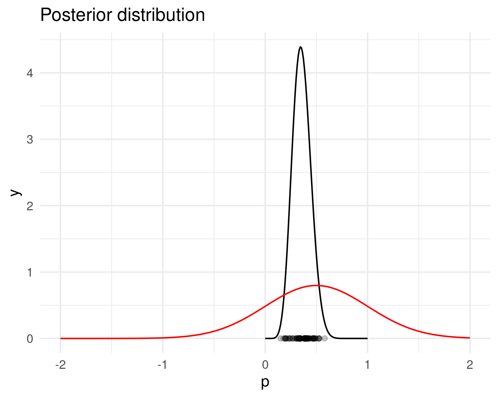
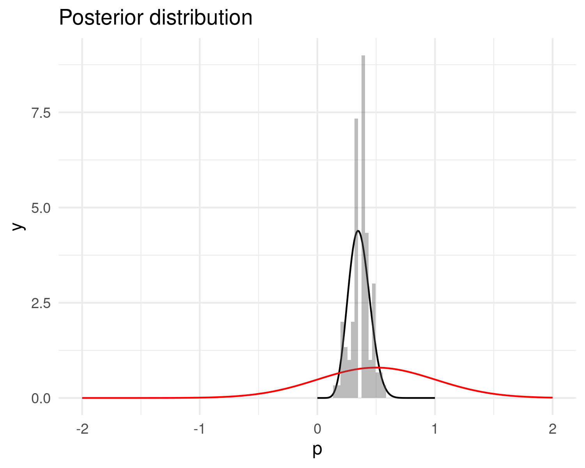

<script type="text/x-mathjax-config">
  MathJax.Hub.Config({ TeX: { extensions: ["color.js", "HTML.js"] }});
</script>


```{r setup, include = FALSE,  eval = TRUE}
library('RefManageR')
main_dir <-  '..'
common_img_dir <- file.path(main_dir,'courses_tools','resources', 'common_figs')
course_img_dir <- file.path(main_dir,'resources', 'figs')
BibOptions(check.entries = FALSE,
           bib.style = "authoryear",
           cite.style = "authoryear",
           style = "markdown",
           hyperlink = TRUE,
           max.names = 3,
           longnamesfirst= FALSE, 
           dashed = TRUE)
myBib <- ReadBib('bayes.bib', check = FALSE)
knitr::opts_chunk$set(echo = FALSE, size='footnotesize', cache = TRUE)
library(ggplot2)
library(tidyverse)
theme_set(theme_minimal() +  theme(
        rect = element_rect(fill = "transparent") # all rectangles
      ))
```

```{r xaringan-fit-screen, echo=FALSE}
xaringanExtra::use_fit_screen()
```


```{r datapackage, eval = TRUE, echo = FALSE, warning = FALSE}
ggplot <- function(...) ggplot2::ggplot(...) + scale_fill_manual(values = wesanderson::wes_palette(name = "Darjeeling1")) + scale_color_manual(values = wesanderson::wes_palette(name = "Darjeeling1")) 
#remotes::install_github('MarieEtienne/coursesdata', force = TRUE)
```


<!-- F1D763 -->
<!-- F7A913 -->
<!-- C94326 -->
<!-- 1F908E -->
<!-- 33658A -->


<!-- # Why do I enjoy research in statistics  ? -->
<!-- -- -->


---
name: intro
# Introduction

---
template: intro
## Previously in Bayes course

```{r resume, echo = FALSE, eval = TRUE, out.width = '70%'}

```

---

template: intro
## Lecture's goal 


A posterior distribution is defined  by 

$$ [\theta \vert y ] = \frac{[y \vert \theta ][\theta]}{[ y ]} \mbox{ with } [ y ] = \int_{\theta} [y \vert \theta ][\theta] d\theta.$$
--

.care[ [y]  is mostly unavailable.]

$$[\theta \vert y ] \varpropto [y \vert \theta ][\theta][ y ]$$

--

### But nothing can stop us!!

$$[\theta \vert y ] = ?$$
---
name: analytic
# Analytical posterior: the magic


--

## Binomial example

### Model presentation


.pull-left[
* Data model: $$\class{bleu}{Y} \sim \mathcal{B}(\class{orange}{n}, \class{bleu}{p}), \quad n \mbox{ known }$$
* Parameter: $\class{bleu}{p}$.
* Specifying an uniform prior $$\class{bleu}{p} \sim \mathcal{U}(0,1)$$
]

--
.pull-right[

```{r DAG1, echo = FALSE, eval = TRUE, out.width = '70%'}
knitr::include_graphics('img/DAG_binom_1.png')
```

]

--

$$[p\vert y ] =  ?$$
---
template: analytic

## Binomial example

### Posterior determination

.rouge[What we know]

$$[p\vert y ] =  \frac{[y\vert p] [p]}{[y]}$$
--

- Likelihood: $[y\vert p] = {n \choose y} p^y (1-p)^{n-y}$
- prior: $[p] = 1_{0\leq p \leq 1}$
- .rouge[predictive]: $[y] = \int_{0}^1 {n \choose y} p^y (1-p)^{n-y}$

--

$[y]$ is a constant but not necessarily easy to compute.

---
template: analytic

## Binomial example

### Posterior identification

Posterior shape:

$$ [p\vert y] \propto K p^y (1-p)^{n-y} 1_{0\leq p \leq 1},$$
with $K$ a constant (in terms of $p$) to be determined.

--

#### Beta distribution 
$X$ follows a Beta distribution with shape parameter $a$ and shape 2 parameter $b$, if  $X$ admits a density $d_X$ given by 
$$d_X(t)=\left\lbrace
\begin{array}{l}
 \frac{\Gamma(a+b)  }{\Gamma(a)\Gamma(b)} t^{a-1} (1-t)^{b-1} \quad t\in [0,1] ,\cr
0 \quad \mbox{otherwise}\cr
\end{array}\right.$$

See [Cheatsheet distribution](LoiProbas.pdf)

---
template: analytic
## Binomial example

### Posterior identification

.pull-left[
* Data model: $$\class{vert}{Y} \sim \mathcal{B}(\class{orange}{n}, \class{bleu}{p}), \quad n \mbox{ known }$$
* Parameter: $\class{bleu}{p}$.
* Specifying an uniform prior $$\class{bleu}{p} \sim \mathcal{B}eta(1,1)$$
]

.pull-right[
```{r DAG1, echo = FALSE, eval = TRUE, out.width = '70%'}
```

]

--

$$ p\vert y \sim \mathcal{B}eta(\class{vert}{y}+1, \class{orange}{n}-\class{vert}{y}+1)  $$
---
template: analytic

## Binomial example

### Information within the data

$$\class{vert}{Y} \sim \mathcal{B}(\class{orange}{n}, \class{bleu}{p}), \quad n \mbox{ known ;} \quad \class{bleu}{p} \sim \mathcal{B}eta(1,1)$$

--


.pull-left[
#### Example 1

$n=10, y=4$ 

```{r info_1, echo = FALSE, eval = TRUE,  message = FALSE, fig.show='hide'}
abc <- seq(0,1, length.out = 1000)
n <- 10
y <- 4
data.frame(p =abc, prior = dbeta(abc, shape1 = 1, shape2=1), posterior = dbeta(abc, shape1 = 1 + y, shape = 1+ n-y)) %>% pivot_longer(cols = c('posterior', 'prior'), names_to = 'type', values_to = 'dens') %>% 
  ggplot() + ylim(c(0, 10)) + geom_line(aes(x=p, y=dens, col=type)) 
  # + ggtitle( glue::glue('n= {n}, y = {y}')) 
  ggsave(filename = "post_beta_10_4.png",  bg = "transparent")
```

  

$$  p\vert y \sim \mathcal{B}eta(\class{vert}{4}+1, \class{orange}{10}-\class{vert}{4}+1) $$

]


--

.pull-right[
#### Example 2

$n=100, y=40$ 

```{r info_2, echo = FALSE, eval = TRUE, fig.show='hide', message = FALSE}
abc <- seq(0,1, length.out = 1000)
n <- 100
y <- 40
data.frame(p =abc, prior = dbeta(abc, shape1 = 1, shape2=1), posterior = dbeta(abc, shape1 = 1 + y, shape = 1+ n-y)) %>% pivot_longer(cols = c('posterior', 'prior'), names_to = 'type', values_to = 'dens') %>% 
  ggplot() + ylim(c(0, 10)) + geom_line(aes(x=p, y=dens, col=type)) 
  # + ggtitle( glue::glue('n= {n}, y = {y}')) 
ggsave(filename = "post_beta_100_40.png",  bg = "transparent")
```

  
  
$$ p\vert y \sim \mathcal{B}eta(\class{vert}{40}+1, \class{orange}{100}-\class{vert}{40}+1)  $$

]

---
template: analytic
## Binomial example

### Some aditional remarks

- A uniform distribution is a $\mathcal{B}eta(1,1)$ distribution.
- Conjugacy:
$$p\sim \mathcal{B}eta(1,1),\quad Y\sim\mathcal{B}(n,p), \quad p\vert y \sim \mathcal{B}eta(y+1,n-y+1)$$


--
* Interpretation of parameter $a$ and $b$ as a number of success and failures.
* What is the value of $[y]$ in this case ?

---
template: analytic

## Regression model 

.pull-left[
* Model : $\class{vert}{Y_k}=\class{bleu}{\beta_0} + \class{bleu}{\beta_1} \class{orange}{x_k} +E_k, \quad E_k\overset{ind}{\sim}\mathcal{N}(0,\class{orange}{\sigma^2})$
* Parameter: $\class{bleu}{\beta_0}, \class{bleu}{\beta_1}$.
* Parameter assumed to be known: $\class{orange}{\sigma^2}$
* Priors on  $\class{bleu}{\theta}=(\class{bleu}{\beta_0},\class{bleu}{\beta_1})$
$$[\class{bleu}{\beta_0},\class{bleu}{\beta_1}] = \mathcal{N}( \class{orange}{\mu_{prior}},  \class{orange}{\Lambda_{prior}}),$$
with $\Lambda_{prior}$ denoting the precision matrix, i.e $\Sigma_{prior}^{-1}$. 

]

.pull-right[
```{r DAG_normal, echo = FALSE, eval = TRUE, out.width = '70%'}


```
]

---
template: analytic

## Regression model 

### Posterior distribution

Prior:

$$[\class{bleu}{\theta}] \propto \exp\left\lbrace  -\frac{1}{2} (\class{bleu}{\theta}- \class{orange}{\mu_{prior}})^\intercal    \class{orange}{\Lambda_{prior}} (\class{bleu}{\theta}- \class{orange}{\mu_{prior}})\right\rbrace,$$


Likelihood:
$$[\class{vert}{y}\vert \class{bleu}{\theta}] \propto \exp\left\lbrace  -\frac{1}{2  \class{orange}{\sigma^2}} ( \class{vert}{y}- \class{orange}{X}\class{bleu}{\theta})^\intercal ( \class{vert}{y}- \class{orange}{X}\class{bleu}{\theta}) \right\rbrace    $$

--

Posterior shape:

$$[\class{bleu}{\theta} \vert  \class{vert}{y}] \propto\exp\left\lbrace  -\frac{1}{2} (\class{bleu}{\theta}- \class{orange}{\mu_{prior}})^\intercal    \class{orange}{\Lambda_{prior}} (\class{bleu}{\theta}- \class{orange}{\mu_{prior}})-\frac{1}{2  \class{orange}{\sigma^2}} ( \class{vert}{y}- \class{orange}{X}\class{bleu}{\theta})^\intercal ( \class{vert}{y}- \class{orange}{X}\class{bleu}{\theta})\right\rbrace ,$$

---
template: analytic

## Regression model 

### Posterior identification

After some calculus

$$[\class{bleu}{\beta_0},\class{bleu}{\beta_1}\vert  \class{vert}{y}] \sim \mathcal{N}(\mu_{post}, \Lambda_{post})$$
with


$$\Lambda_{post} =  \left ( \frac{\class{orange}{X^{\intercal}}\class{orange}{X}}{\class{orange}{\sigma^2}}+\class{orange}{\Lambda_{prior}}\right )$$

$$\mu_{post} =\left (  \frac{\class{orange}{X^{\intercal}}\class{orange}{X}}{\class{orange}{\sigma^2}}+\class{orange}{\Lambda_{prior}}\right )^{-1}\left(\frac{\class{orange}{X^{\intercal}}\class{bleu}{Y}}{\class{orange}{\sigma^2}} +\class{orange}{\Lambda_{prior}}\class{orange}{\mu_{prior}} \right)$$

--

Again a conjugacy property. 

With a normal prior, the posterior is also normal.

---
name: sampling 
# Sampling from posterior distribution


--
## Why was Bayesian approach so uncommon

- Analytical posterior distributions are rarely accessible 

--

- Computing the normalizing constant in general

  - Deterministic numerical integration  is possible but tends to behave poorly when the number of parameters increase
  
  - Stochastic integration methods : Monte Carlo methods

--

- Avoiding the need of the normalizing constant : sampling instead of integrating
  - an old idea which became possible with increasing computing performance

---
template: sampling 

## Why a sample is mostly enough ?

### Quantities of interest 

.center[
$$E[\class{bleu}{p}\vert  \class{vert}{y}] =  ?,  \quad CI_{0.95}(\class{bleu}{p}\vert  \class{vert}{y}) =  ?$$
]

--

.pull-left[
```{r, fig.show='hide'}
xseq <- seq(0, 1, length.out=100)
sh1  <- 10
sh2  <- 18
density.post <- dbeta(xseq, shape1 = sh1, shape2 = sh2)
df <- data.frame(x=xseq, y =density.post)
p <- ggplot(data=df, aes(x=x, y=y)) +
  geom_line() + xlab('p') +
  ggtitle('Posterior distribution')  +
  geom_vline(xintercept = sh1 / (sh1 + sh2), linetype= 'dashed', col = 'red') + 
  geom_segment(aes(x = qbeta(0.025, shape1 = sh1, shape2 = sh2),
                               xend = qbeta(0.975, shape1 = sh1, shape2 = sh2),
                               y = 0,
                               yend = 0), col='red')
suppressMessages(ggsave(filename = 'figMC1.png', width = 5, height = 4))
```


```{r figMC1_show, echo = FALSE, eval = TRUE, out.width = '60%'}

```
]

---
template: sampling 

## Why a sample is mostly enough ?

### Quantities of interest 

.center[
$$E[\class{bleu}{p}\vert  \class{vert}{y}] =  ?,  \quad CI_{0.95}(\class{bleu}{p}\vert  \class{vert}{y}) =  ?$$
]

--

.pull-left[

```{r,  fig.show='hide'}
n1 <- 100
sim <- rbeta(n = n1, shape1 = sh1, shape2 = sh2)
p.MC <- p + geom_point(data= data.frame(x=sim, y=rep(0,n1)), aes(x=x,y=y), alpha=0.2 )
print(p.MC)
suppressMessages(ggsave(filename = 'figMC2.png', width = 5, height = 4))
```


### Assuming we got a sample

```{r figMC2_show, echo = FALSE, eval = TRUE, out.width = '60%'}
knitr::include_graphics('figMC2.png')
```

* $E[\class{bleu}{p}\vert  \class{vert}{y}] \approx \frac{1}{n} \sum_{k=1}^n p_i$
* $CI_{0.95}(\class{bleu}{p}\vert  \class{vert}{y}) \approx [p_{(n*0.025)}, p_{(n*0.975)} ] ?$

]

--
.pull-reight[


.center[
.rouge[
Monte Carlo Approximation
]
]
]


```{r,  fig.show='hide'}
 df <- data.frame(c('Mean', 'CIInf', 'CISup'), 'theory'=c(sh1/(sh1+sh2), qbeta(0.05, shape1 = sh1, shape2 = sh2), qbeta(0.95, shape1 = sh1, shape2 = sh2) ), c(mean(sim), quantile(sim, probs = 0.05), quantile(sim, probs = 0.95)))
n2 <- 1000
sim <- rbeta(n = n2, shape1 = sh1, shape2 = sh2)
 
df =cbind(df,c(mean(sim), quantile(sim, probs = 0.05), quantile(sim, probs = 0.95)))
names(df) = c('Sum','Theory', paste0('MC',n1), paste0('MC',n2) )
print(df)
```


.center[
.rouge[
Monte Carlo Approximation
]
]
]


---
template: sampling 

## Importance sampling 

### Key idea : mathematical point of view

$$E_{d_X}(\class{bleu}{h(X)})  =\int_u \class{bleu}{h(u)} \, d_{X}(u) du$$
--

\begin{align*}
E_{d_X}(\class{bleu}{h(X)}) & = \int_u \class{bleu}{h(u)} \, d_{X}(u) du \cr
                                & = \int_u  h(u)\, \frac{d_{X}(u)}{\class{vert}{d_Z(u)}  } \class{vert}{d_Z(u)} du\cr 
                                & =\int_u \class{rouge}{ h(u)\, \frac{d_{X}(u)}{d_Z(u)}  } d_Z(u) du \cr 
                                & = E_{\class{orange}{d_Z}}\left(\class{rouge}{ h(Z) \frac{d_{X}(Z)}{d_Z(Z)}}\right)
\end{align*}


```{r, fig.show='hide'}
xseq <- seq(0, 1, length.out=100)
sh1  <- 10
sh2  <- 18
density.post <- dbeta(xseq, shape1 = sh1, shape2 = sh2)
df <- data.frame(x=xseq, y =density.post)

p <- ggplot(data=df, aes(x=x, y=y)) +geom_line() + xlab('p') + ggtitle('Posterior distribution') + stat_function(fun = dnorm, args = list(mean = 0.5, sd = 0.5), col='red') + xlim(c(-2,2))
print(p)

proposal <- rnorm(n1, mean=0.5, sd=0.5)

p1 <- p + geom_point(data=data.frame(x=proposal, y=rep(0,n1)),  col='red', alpha=0.2)
print(p1)
suppressMessages(ggsave(filename = 'IS1.png', width = 5, height = 4))

weight <- dbeta(proposal, shape1 = sh1, shape2 = sh2)/dnorm(proposal, mean=0.5, sd=0.5)

p2 <- p + geom_point(data=data.frame(x=proposal, y=rep(0,n1), weight=weight),  aes(x=x, y=y, size=weight), col='black', alpha=0.2)
print(p2)
suppressMessages(ggsave(filename = 'IS2.png', width = 5, height = 4))

keep <- sample(proposal, size = n1, replace = TRUE, prob = weight)
p3 <- p + geom_point(data=data.frame(x=keep, y=rep(0,n1)),  aes(x=x, y=y), col='black', alpha=0.2)
print(p3)
suppressMessages(ggsave(filename = 'IS3.png', width = 5, height = 4))

p4 <- p + geom_histogram(data=data.frame(x=keep), aes(x=x, y=..density..), alpha=0.4, binwidth = 0.03)
suppressMessages(print(p4))
suppressMessages(ggsave(filename = 'IS4.png', width = 5, height = 4))

set.seed(2)
proposal <- rnorm(n2, mean=0.5, sd=0.5)

p1 <- p + geom_point(data=data.frame(x=proposal, y=rep(0,n2)),  col='red', alpha=0.2)
print(p1)
suppressMessages(ggsave(filename = 'IS1_1000.png', width = 5, height = 4))

weight <- dbeta(proposal, shape1 = sh1, shape2 = sh2)/dnorm(proposal, mean=0.5, sd=0.5)

p2 <- p + geom_point(data=data.frame(x=proposal, y=rep(0,n2), weight=weight),  aes(x=x, y=y, size=weight), col='black', alpha=0.2)
print(p2)
suppressMessages(ggsave(filename = 'IS2_1000.png', width = 5, height = 4))

keep <- sample(proposal, size = n2, replace = TRUE, prob = weight)
p3 <- p + geom_point(data=data.frame(x=keep, y=rep(0,n2)),  aes(x=x, y=y), col='black', alpha=0.2)
print(p3)
suppressMessages(ggsave(filename = 'IS3_1000.png', width = 5, height = 4))

p4 <- p + geom_histogram(data=data.frame(x=keep), aes(x=x, y=..density..), alpha=0.4)
suppressMessages(print(p4))
suppressMessages(ggsave(filename = 'IS4_1000.png', width = 5, height = 4))

```
---

template: sampling 

## Importance sampling algorithm

1. Sample from proposal distribution : $\class{orange}{(z_i)_{i=1,\ldots N}}$. 

--
2. For every particle $i$, Compute weight 
$$\class{rouge}{w_i} = {d_X(z_i)/d_Z(z_i)}$$ 

--
3. Normalize weight
$$\class{rouge}{\tilde{w}_i} = \frac{w_i}{\sum_{i=1}^{N} w_i}$$ 

--
$(\class{orange}{z_i},\class{rouge}{\tilde{w}_i})$ is a weighted sample from $d_X$. 

--
4. Resample to get unweighted sample $\class{bleu}{(x_i)_{1\leq i \leq n}}$. 

Sample in $\class{oange}{(z_i)}$ with replacement with a probability $\class{rouge}{\tilde{w}_i}$ to get  $\class{bleu}{(x_i)_{1\leq i \leq n}}$.

---

template: sampling 

## Importance sampling algorithm remarks

* If $d_X$ is known up to constant, (for instance . $[p\vert y ]\propto [y\vert p] [p]$)

$d_X = K \tilde{d}_X,$

Weights are defined as $\omega_i = \tilde{d}_X(z_i) / d_Z(z_i)$

Normalized weights are 
$$\tilde{\omega}_i =\frac{\omega_i}{\sum_i\omega_i} = \frac{w_i}{\sum_{i=1}^{N} w_i}$$


---
template: sampling 
### IS algorithm : graphical point of view 
1. Step 1 : sample from proposal ( $N=100$ )

  


---
template: sampling 
### IS algorithm : graphical point of view 
2. Step 2 : compute weight ( $N=100$ )

  

---
template: sampling 
### IS algorithm : graphical point of view 
3. Step 3 : Resample to get unweighted sample ( $N=100$ )

  


---
template: sampling 
### IS algorithm : graphical point of view 
3. Step 3 : Resample to get unweighted sample ( $N=100$ )

  


---
template: sampling 
### IS algorithm : graphical point of view  
3. Step 3 : Resample to get unweighted sample ( $N=1000$ )

  


---
template: sampling 
### IS algorithm : graphical point of view  
3. Step 3 : Resample to get unweighted sample ( $N=1000$ )

  


---
template: sampling 

### Importance sampling conclusion

* Simple and appealing

* .rouge[But,  it is crucial to have a good proposition distribution.]
Which is not so straightforward

---

## Monte Carlo Markov Chain algorithm (MCMC)

###  Markov chain definition
A Markov chain is a sequence of random variables $(X_1, \ldots,X_n)$ verifying the Markov property. --
$$[X_{i+1}\vert \class{rouge}{X_{1:i}}] = [X_{i+1}\vert \class{rouge}{X_i}].$$
--

#### Some examples
- Ex1: Head or tail: +1 if tail, -1 if head. $X_n$ being the fortune at time $n$, $(X_n)$ is a Markov chain.
- Ex2: Movement on a grid: at time $n$, the player moves on one adjacent cell with equal probability. $X_n$ being the position at time $n$, $(X_n)$ is a Markov chain.


### Markov chain example - Ex1

Random walk 
$$X_{n+1} = X_{n} + E_{n+1}, \quad E_{n+1}\overset{ind}{\sim}\mathcal{U}(\{-1,1\})$$
$(X_n)$ is a Markov chain. \par


```{r, fig.show='hide'}
n <- 100
E <- sample(c(-1,1), replace=TRUE, size= n)
X <- cumsum(E)
p1 <- ggplot(data=data.frame(time=seq(1,n), X=X)) + geom_line(aes(x=time, y=X))
print(p1)
suppressMessages(ggsave(filename = 'RW1.pdf', width = 5, height = 4))


Z <- sapply(1:n, function(i_){max(X[1:i_])})
p2<-  p1 +geom_line(data = data.frame(time=seq(1,n), Z=Z), aes(x=time, y=Z), col='red')
print(p2)
suppressMessages(ggsave(filename = 'SuppRW1.pdf', width = 5, height = 4))
```

\begin{figure}
\includegraphics[width=0.65\textwidth]{RW1.pdf}
\end{figure}


### Markov chain example - Ex1

Supremum of a random walk 
$Z_n = max_{k=1}^n X_k,$ 

\begin{figure}
\includegraphics[width=0.65\textwidth]{SuppRW1.pdf}
\end{figure}

--
$(Z_n)$ is not a Markov chain.


### Markov chain vocabulary

\alert{State space} $\mathcal{S}$: the set of possible values for $(X_n)$.

\alert{Initial distribution} $\nu_0$: the distribution for $X_0.$

\alert{Transition distribution} $\pi^{(i)}$: the distribution for $X_{i+1} \vert X_{i}$

\alert{Homogeneity} if $\pi^{(i)}$ does not depend on $i$ the MC is said homogeneous.


### Markov chain example - Ex1

Random walk 
$$X_0=0, \quad X_{n+1} = X_{n} + E_{n+1}, \quad E_{n+1}\overset{ind}{\sim}\mathcal{U}(\{-1,1\})$$
$(X_n)$ is a Markov chain. \par

with 
- State space $\mathcal{S}=\mathbb{Z},$\par
- Initial distribution $\nu_0=1_{\left\lbrace x=0\right \rbrace},$\par
- Transition distribution $\pi(x, x+1) = 1- \pi(x, x-1) = .5$


### Markov chain properties
\footnotesize
Let $X_n$ be an homogeneous Markov chain on state space $\mathcal{S}$ with initial distribution $\nu_0$ and transition $\pi$. 

\alert{ Distribution of $X_1$ ?}
--

\begin{align}
\P(X_1 =x) & = \int_{x_0} \P(X_0=x_0, X_1 = x) d_{x_0}\\
& = \int_{x_0} \pi(x_0, x) \nu_{0}(x_0) d_{x_0}\\
\end{align}

On note $\nu_0 \pi$ la loi de $X_1$.

--

\alert{ Distribution of $X_n$ ?}
\begin{align*}
\P(X_n =x) & = \int_{x_0} \int_{x_1}  \ldots \int_{x_{n-1}}\P(X_0=x_0, X_1 = x_1, \ldots, X_{n-1}=x_{n-1}, X_n = x) d_{x_0}d_{x_1} \ldots d_{x_{n-1}}\\
& =\int_{x_0} \int_{x_1}  \ldots \int_{x_{n-1}} \nu_0(x_0) \pi(x_0, x_1)  \ldots \pi(x_{n-1}, x)  d_{x_0}d_{x_1} \ldots d_{x_{n-1}}\\
\end{align*}

\normalsize


### Markov chain properties

\begin{block}{Definition}
$\nu$ is a stationary distribution if and only if 
$$ X_i \sim \nu \Longrightarrow X_{i+1} \sim \nu$$  
\end{block}

\footnotesize

Example On/Off:
Let $p = (p_0, p_1),$ and let $X_n$ be defined by 
$$ X_0 \sim \mathcal{B}(p_{init}), \quad X_{n+1}\vert X_n \sim \mathcal{B}(p_{X_n})$$

\begin{figure}
\includegraphics[height=0.4\textheight]{OnOff.pdf}
\end{figure}
--

\class{rouge}{Distribution of $X_1$, $X_2$, ... ?}


###  Markov chain properties

\begin{block}{Ergodic property}

If a Markov chain $(X_i)$ is irreducible, aperiodic and recurrent then there is exists a unique stationnary distribution $\pi$ and
$$[X_n] \underset{n\to \infty}{\longrightarrow } \pi . $$

\end{block}

If a Markov chain $(X_i)$ is reversible ($[X_i][X_{i+1}\vert X_i] = [X_{i+1}] [X_i\vert X_{i+1}]$) then this Markov chain admits a stationary distribution. 


### Consequences of the ergodic theorem

If $(X_n)$ is a Markov chain with stationary distribution, for any initial $\nu_0$, $[X_n]$ is close to the stationary distribution.
--


\alert{Back to the example on/off:}       

```{r on_off,  out.width='60%', warning=FALSE}
n <- 1e4
X <- rep(NA,n)
p <- c(0.2, 0.6)
X[1] <- 0
for(i in 1:n){
  X[i+1] <- sample( x = c(0,1), size = 1, p = c(1- p[X[i]+1], p[X[i]+1] ))
}
p1 <- ggplot(data=data.frame(time=seq(0,n), X=X)) + geom_line(aes(x=time, y=X)) + xlim(c(0,100))
print(p1)
```

### Consequences of the ergodic theorem

If $(X_n)$ is a Markov chain with stationary distribution, for any initial $\nu_0$, $[X_n]$ is close to the stationary distribution.
--


\alert{Back to the example on/off:}       


```{r first100, echo=FALSE, out.width='60%'}
set.seed(1)
X %>% as_tibble() %>% mutate(n=1:n(), count=cumsum(X==1), freq=count/n) %>% 
  ggplot() + geom_line(aes(x=n , y = freq)) + labs(x = 'time', y = "proportion of 1's" ) +
  geom_hline(yintercept = 1/3, col = 2, linetype = 'dashed') +
  ggtitle("Evolution of the proportion of 1's")
```


### Metropolis Hastings algorithm

Key idea : building a reversible Markov chain with $[\theta\vert y]$ as stationnary distribution
--

1. Initialization   $\theta^{(0)}$ an admissible initial value
2. For i in 1:nIter
  + Propose a new candidate value $\theta_c^{(i)}$ sampled from a proposal distribution $g(. \vert \theta^{(i-1)})$
  + Compute Metropolis Hastings ratio
    $$ r_i=\class{bleu}{\frac{[y\vert \theta_c^{(i)}] [\theta_c^{(i)} ] }{[y\vert \theta^{(i-1)}] [\theta^{(i-1)} ] } } \class{rouge}{\frac{g(\theta^{(i-1)} \vert \theta_c^{(i)})}{g(\theta_c^{(i)} \vert \theta^{(i-1)})}}$$
    + Define 
    $$ \theta^{(i)} =\left \lbrace
    \begin{array}{l}
    \theta_c^{(i)} \mbox{ with probability } min( r_i,1) \\
    \theta^{(i-1)} \mbox{ with probability } 1-min( r_i,1) \\
    \end{array}\right.$$


```{r ggplot_back, echo = FALSE, eval = TRUE}
ggplot <- function(...) ggplot2::ggplot(...) 
```


### Capture efficiency estimation

20 fishes have been released around a trap, and 5 of them are caught. 

1. Propose a model of the experiment
2. Define the parameter(s) of interest
3. Characterize the prosterior distribution
  - analytically
  - by simulation
  


### Capture efficiency estimation using jags

see capture.R


### Capture Recapture

Experimental design:

- $M=50$ fishes are marked and released in a lake.

- a trap is set in the lake
  - $R=25$ fish caught are marked
  - $R=133$ fish caught are unmarked
  
How to estimate the total size of the population ?  


### References
